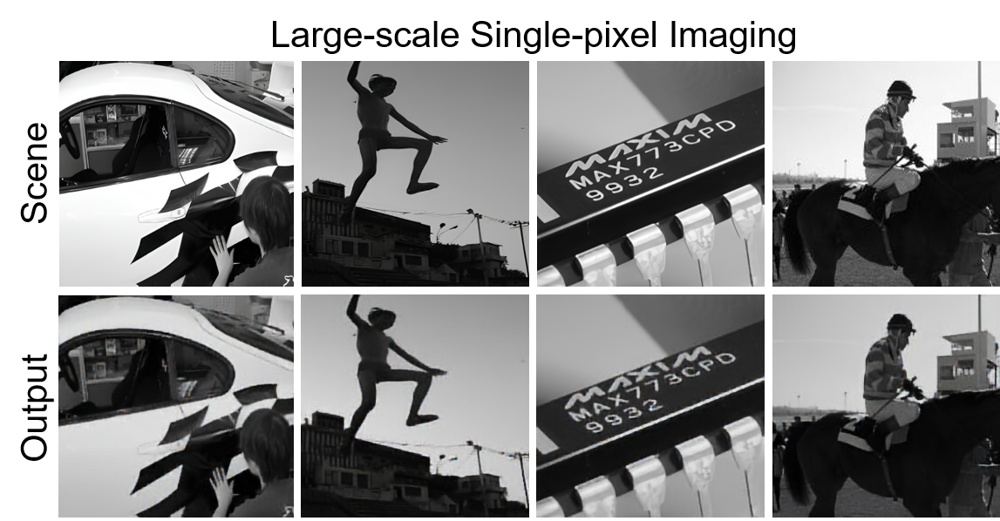
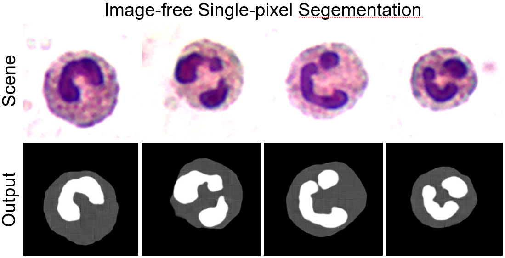

# Large-Scale Single-Pixel Imaging and Sensing


## 1. 💻 System requirements
### 1.1 All software dependencies and operating systems
The project has been tested on Windows 10 and Ubuntu 20.04.6 LTS.
### 1.2 Versions the software has been tested on
The project has been tested on Python 3.9 and pytorch 1.11.
### 1.3 Any required non standard hardware
There is no non-standard hardware required for this project. 


## 2. 🛠️ Installation guide
### 2.1 Instructions

**Create conda pytorch environment**
```
conda create -n SPIS python=3.9
conda activate SPIS
conda install pytorch=1.11 torchvision cudatoolkit=11.3 -c pytorch
```

**Clone the SPIS repository**
```
git clone https://github.com//SPIS.git
cd SPIS
```

**Install dependencies**
```
pip install -r requirements.txt
```
    
### 2.2 Typical install time on a "normal" desk top computer 
The installation time is approximately 5 minute and fluctuates depending on network conditions.

## 3. 🎥 Demo
### 3.1 Instructions to run on data
#### 3.1.1 How to run the large-scale single-pixel imaging demo
We have provided the measurements for testing in the  `./Large-scale-single-pixel-imaging/features` folder. You can directly run the following command in the terminal to reconstruct the image:
```
cd ./Large-scale-single-pixel-imaging
```
Then, run the following command:

```
python imaging.py
```
SPIS reconstruction results will be saved in the `./Large-scale-single-pixel-imaging/results` folder


#### 3.1.2 How to run the image-free single-pixel segmentation demo
We have provided the measurements for testing in the  `./image-free-segmentation/features` folder. You can directly run the following command in the terminal to segment the scene:
```
cd ./image-free-segmentation
```
Then, run the following command:

```
python segmentation.py
```
SPIS segmentation results will be saved in the `./image-free-segmentation/results` folder


#### 3.1.3 How to run the image-free single-pixel object detection demo
We have provided the measurements for testing in the  `./image-free-object-detection/features` folder. You can directly run the following command in the terminal to detect the objects in the scene:
```
cd ./image-free-object-detection
```
Then, run the following command:

```
python detection.py
```
The detection results will be output directly to the terminal and the visualized detection results will show on the screen.


### 3.2 Expected output

#### 3.2.1 Expected output of large-scale single-pixel imaging
SPIS reconstruction results will be saved in the `./Large-scale-single-pixel-imaging/results` folder.



#### 3.2.2 Expected output of image-free single-pixel segmentation
The image-free single-pixel segmentation results will be saved in the `./image-free-segmentation/results` folder.




#### 3.2.3 Expected output of image-free single-pixel object detection
The detection results will be output directly to the terminal and the visualized detection results will show on the screen.


### 3.3 Expected run time for demo on a "normal" desktop computer
The estimated time it takes to synthesize an image is typically around 0.5 seconds and can vary depending on the device. The estimated time it takes to enhance an image is typically around 0.2 second and can also vary depending on the device.

## 4. Instructions for use
### 4.1 How to run the large-scale single-pixel imaging on your data
We have provided the optimized small-size patterns in the  `./Large-scale-single-pixel-imaging/pattern` folder. If you want to run single-pixel imaging on your data, you should first put your data in the `test` folder and run `simulate.py` to generate the measurements of your data. The program will read images from the test folder, then use the network-optimized small-size pattern to sample the images and generate 2D measurements, and save them in the `./Large-scale-single-pixel-imaging/features` folder.

First, generate measurements:
```
python simulate.py
```
Then, reconstruct the scene:
```
python imaging.py
```

### 4.2 How to run the image-free single-pixel segmentation on your data
You can run `simulate.py`  if you want to generate the measurements by yourself. The program will read images from the test folder, then use the network-optimized small-size pattern to sample the images and generate 2D measurements, and save them in the `./image-free-segmentation/features` folder.

First, generate measurements:
```
python simulate.py
```
Then, segment the scene:
```
python segmentation.py
```
The pre-trained model we provide is trained on the WBC dataset, and it can only segment white blood cells. If you want to test SPIS on other segmentation data, you need to retrain SPIS. First, put your training and testing data in the `data` folder and replace the original WBC dataset according to the original file structure. Then run  `trainUDL005_step1.py ` to start the first training stage.

```
python trainUDL005_step1.py
```
After the first training stage, write the path of the optimal pre-training model(checkpoint) in line 42 of `trainUDL005_step2.py`, and run `trainUDL005_step2.py` to start the second stage.

```
python trainUDL005_step2.py
```
After the second stage of training, assign the path of the optimal network checkpoint to the `model_path` variable of `pattern.py`. Then run `pattern.py` to generate the `pattern_005.mat` file.
```
python pattern.py
```
Next, put your test data in the `test` folder. Then run `simulate.py` to generate the measurements of your data.
```
python simulate.py
```
At last, run the image-free snle-pixel segmentation on your data:
```
python segmentation.py
```

### 4.3 How to run the image-free single-pixel object detection on your data
We have provided the optimized small-size patterns in the  `./image-free-object-detection/pattern_005.mat` file. If you want to run image-free single-pixel object detection on your data, you should first put your data in the `test` folder and run `simulate.py` to generate the measurements of your data. The program will read images from the test folder, then use the network-optimized small-size pattern to sample the images and generate 2D measurements, and save them in the `./image-free-object-detection/features` folder.

First, generate measurements:
```
python simulate.py
```
Then, run the image-free snle-pixel object detection:
```
python detection.py
```
